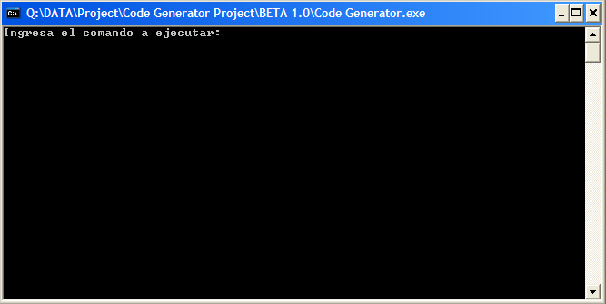
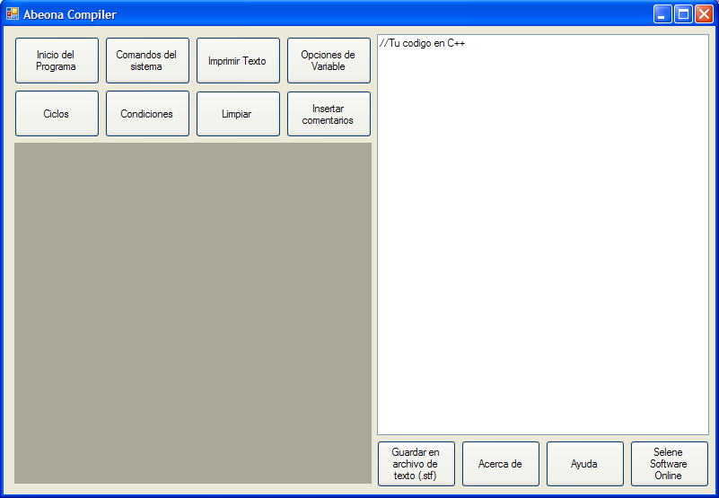
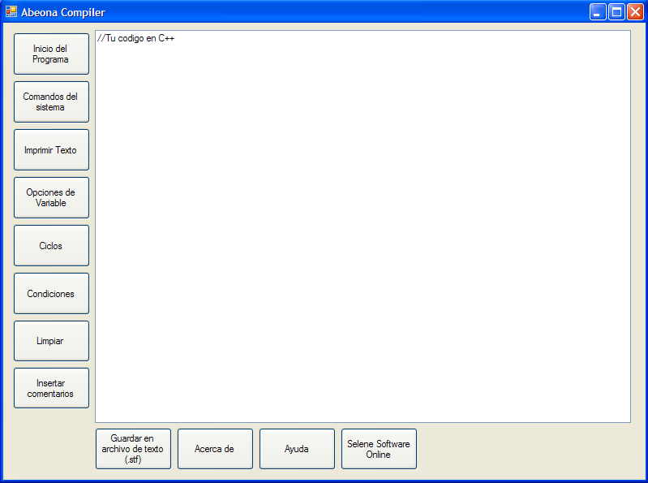
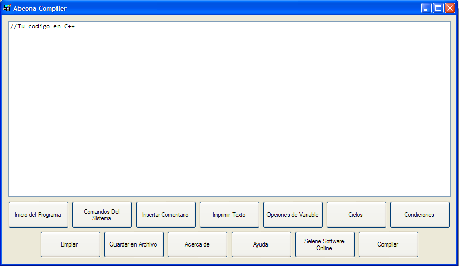
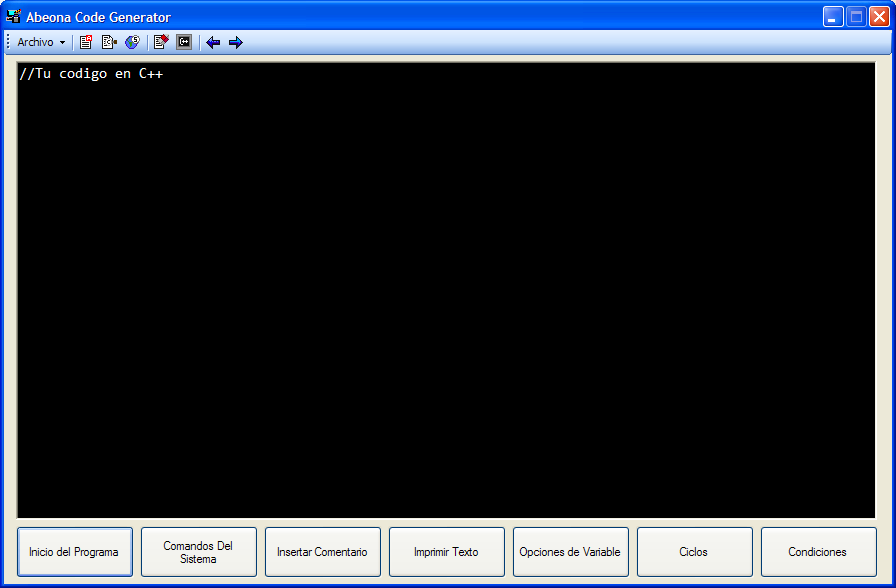
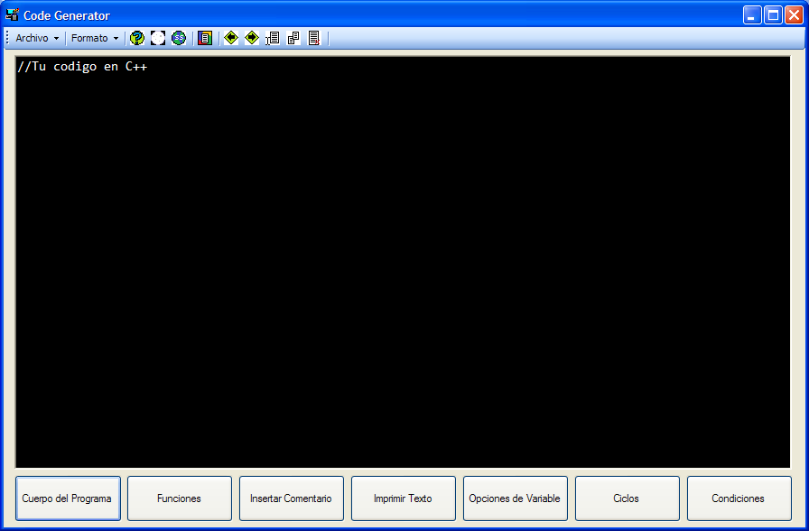
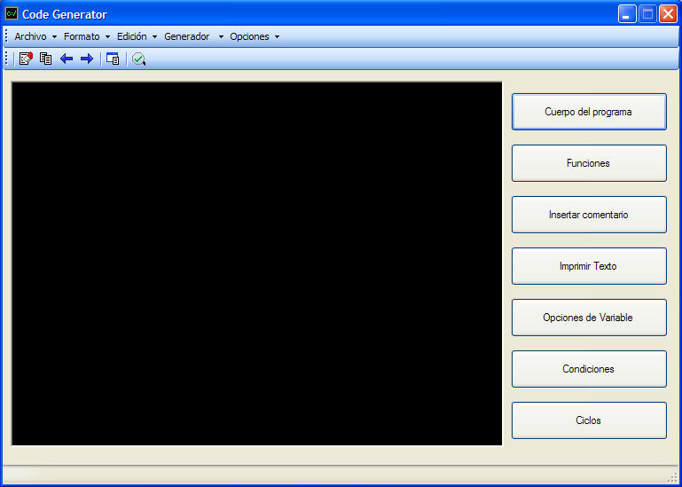
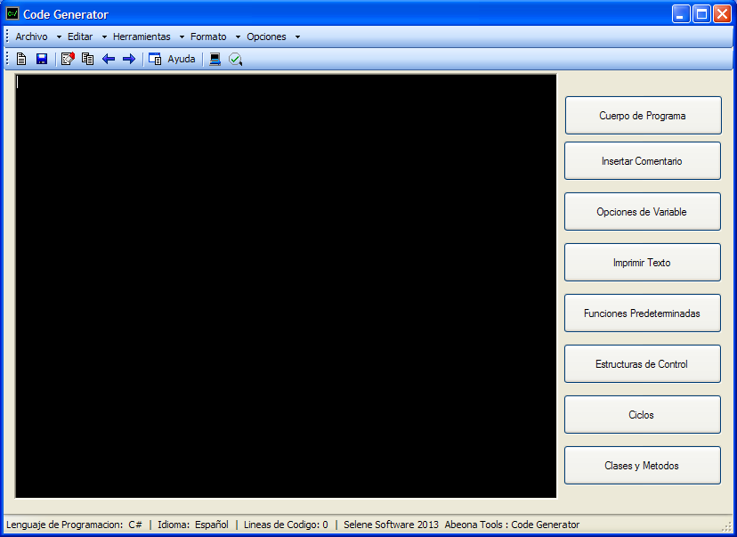
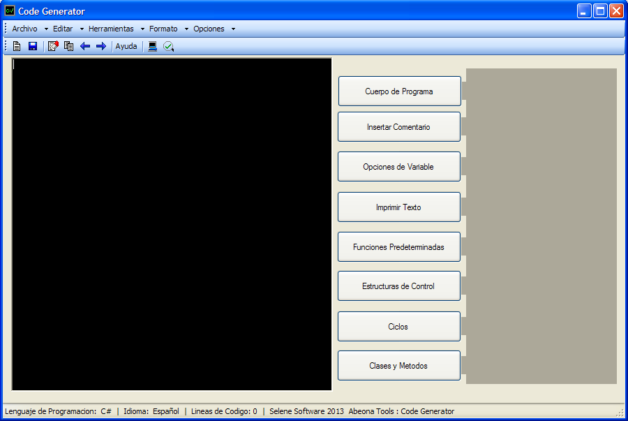

# Abeona · Code Generator y lenguaje Ñ (2013–2017)

Archivo histórico del primer proyecto de software de Néstor Rodríguez (Selene Software).

**Code Generator** permitía construir programas de consola en **C++** y **C#** sin escribirlos: cada acción (declarar una variable, imprimir texto, un `if`, un ciclo…) tenía su ventana, y el programa generaba el código. Estaba pensado para estudiantes que empiezan a programar y tienen problemas para pasar de un diagrama de flujo al código.

Se construyó para **venderse** como producto: CD con autorun, instalador, validador de licencias y manual de usuario, a un precio de $370–400 MXN. Durante el desarrollo, a sugerencia de una maestra, se presentó en el concurso de creatividad tecnológica de 2014 en Tepic (CECyTEN Plantel Tepic) para darlo a conocer, y en 2015 llegó a la etapa nacional.

También incluye lo que se conserva de **[Ñ](#lenguaje-ñ-20142017)**, un lenguaje de programación en español que nació de la misma idea.

> Este repositorio es de solo lectura: el código no se mantiene.
> La nueva versión se desarrolla en el repositorio **Abeona-Project**.

## Evolución

| Versión | Fecha | Cambios | Captura |
|---|---|---|---|
| BETA 1.0 | 27 mar 2013 | En C++ y de consola: el usuario escribía comandos y recibía el código | [beta](capturas/beta.png) |
| 1.0 | 11 abr 2013 | Primera interfaz gráfica, con paneles. Primera versión mostrada al público | [1.0](capturas/1.0.png) |
| 1.7 | 16 may 2013 | Intento de usar ventanas en lugar de paneles; quedó incompleta | [1.7](capturas/1.7.png) |
| 2.0 | 16 may 2013 | Retoma las ventanas; se volvió la base de las siguientes versiones | [2.0](capturas/2.0.png) |
| 3.0 | 24 may 2013 | Barra de herramientas y pantalla de código negra | [3.0](capturas/3.0.png) |
| 4.0 | 8 jul 2013 | Corrección de errores y más funciones | [4.0](capturas/4.0.png) |
| 5.0 | 11 ago 2013 | Reescrita desde cero, nueva interfaz y primer validador de licencias | [5.0](capturas/5.0.png) |
| Validador 1.0 | 13 ago 2013 | Ventana de activación contra la piratería | — |
| 6.0 | oct 2013 | Elección de lenguaje (C++ o C#) e idioma, con barra de estado. **Código en `src/code-generator/`** (ensamblado 5.9.0.0) | [6.0](capturas/6.0.png) |
| 7.0 BETA | nov 2013 | Captura de la 7.0 en desarrollo | [7.0 BETA](capturas/7.0-beta.png) |
| Console 2.0 | abr 2014 | Consola que traduce comandos en español a C# y los compila; integrada en Code Generator C# 7.0. Antecedente de [Ñ](#lenguaje-ñ-20142017) | — |
| C++ 6.0 y C# 7.0 | nov 2014 | Code Generator se divide en una aplicación por lenguaje, con archivos de proyecto (`.cgp`, `.cgc`, `.cgv`, `.cg`) y un visor. **Código en `src/code-generator-2014/`** | — |

Las notas originales de cada versión están en [`notas-de-version/`](notas-de-version/).

Entre 2013 y 2014 se empezó **Diagram Generator**, un prototipo para dibujar diagramas de flujo. En 2015 el plan era convertir Abeona en una suite web gratuita: Diagram Generator, Code Generator, Compiler, App Generator, Desk Tester y Web Designer.

### Capturas

| | | |
|---|---|---|
|  |  |  |
| BETA 1.0 | 1.0 | 1.7 |
|  |  |  |
| 2.0 | 3.0 | 4.0 |
|  |  |  |
| 5.0 | 6.0 | 7.0 BETA |

## Encuesta 2014

En 2014 se hizo una demostración con encuesta a **41 alumnos** y **16 docentes**. Datos en [`encuesta-2014/`](encuesta-2014/).

**Alumnos (41)**
- 38 creen que el programa les ayudaría; 36 lo usarían en clase; 34 lo recomendarían.
- 30 lo comprarían.
- 25 lo manejaron con facilidad en la demostración.
- Solo 6 habían programado antes.

**Docentes (16)**
- Los 16 dicen que sus alumnos tienen problemas para aprender a programar, y los 16 creen que el programa les ayudaría.
- 15 lo consideran fácil de usar y 15 lo incluirían en el programa de estudios.
- Calificación promedio: 8.4 de 10.

**Precio:** el precio planteado subió de $300 a $370–400 MXN. En promedio, los encuestados propusieron un precio de $1,151 MXN.

## Lenguaje Ñ (2014–2017)

**Ñ** fue un lenguaje de programación con palabras clave en español para "programar algoritmos académicos sencillos con un lenguaje simple y completamente en español" (descripción del Compilador Ñ). Es la evolución de la idea de Code Generator: escribir el programa directamente en español en lugar de armarlo con botones.

No se conserva el traductor de la versión 2.5, pero sí su manual. Esto es lo que queda:

| Fecha | Qué se conserva | Dónde |
|---|---|---|
| abr 2014 | **Code Generator Console 2.0**, el antecedente: comandos en español que se traducen a C# y se compilan | `src/code-generator-2014/cs/Code Generator 6.0/compiler.cs` |
| ene 2015 | Íconos de tipos de archivo de la suite: Ñ aparece junto a C#, C++, VB.NET, HTML, SQL y Java como lenguaje de Compiler y de Code Generator | `documentos/Presentación1.pptx` |
| 2015 | La ficha técnica de Abeona anuncia un "Anexo III: Ñ: Una alternativa a BASIC", pero el contenido del anexo no se encontró | Ficha técnica (no incluida por datos personales) |
| 2015 | **Manual "Introducción al lenguaje Ñ"** (v2.5): sintaxis, tipos de datos, entrada y salida, estructuras de control y ejemplos | `documentos/Manual de usuario.pdf` |
| nov 2016 | **Compilador Ñ 3.0** (IntelINay): IDE de demostración para la versión 2.5 del lenguaje | `src/lenguaje-n/compilador-2016/` |
| ene 2017 | **Proyecto Ñ**: esqueleto de un intérprete en .NET Core con un ejemplo de una sintaxis nueva | `src/lenguaje-n/interprete-2017/` |

> Los enlaces a `selenesoft.net` del manual y el correo de Compilador Ñ ya no pertenecen al proyecto: el dominio se perdió.

### Code Generator Console (2014)

Cada línea empezaba con un comando en español que se traducía a C#:

| Comando | C# generado |
|---|---|
| `INICIO` … `FIN` | Plantilla con `using`, `namespace`, `class Program` y `Main`, y su cierre |
| `USAR x COMO ENTERO` | `int x;` (también `FLOTANTE`, `DOBLE`, `CADENA` y `CARACTER`; sin tipo, `var x;`) |
| `DECLARAR x = 5` | `x = 5;` |
| `IMPRIMIR "texto"` / `SALTO` | `Console.Write("texto");` / `Console.WriteLine("");` |
| `PEDIR x` | `x = Console.ReadLine();` |
| `SI cond` / `NO` / `CERRAR` | `if(cond) {` / `else {` / `}` |
| `MIENTRAS cond` | `while(cond) {` |
| `HACER` … `H-MIENTRAS cond` | `do{` … `}while(cond);` |
| `EN i=1;i<=10;i++` | `for(i=1;i<=10;i++)` |
| `SEGUN x` / `CASO v` / `ROMPER` | `SWITCH(x) {` / `case v:` / `break;` |
| `ESPERAR n` / `PAUSA` / `LIMPIAR` | `System.Threading.Thread.Sleep(n);` / `Console.ReadKey(true);` / `Console.CLEAR();` |

La consola también tenía comandos propios: `GUARDAR`, `VER`, `COMPILAR`, `ABRIR`, `ENVIAR` (manda el código a Code Generator), `REINICIAR`, `AYUDA` y `SALIR`.

Tres comandos generaban C# inválido: `DOBLE` producía `doble`, `SEGUN` producía `SWITCH` en mayúsculas y `LIMPIAR` producía `Console.CLEAR()`.

### Ñ 2.5 según su manual

El manual lo presenta como un lenguaje "con una sintaxis sencilla para que las personas que van entrando en el mundo de los lenguajes de la programación pudieran iniciar su camino con un lenguaje amigable y en su propio idioma".

- **Estructura:** el programa abre con `INICIO` y cierra con `FIN`, siempre en mayúsculas. Va una instrucción por línea, sin `;`, y las palabras clave no llevan acentos.
- **Tipos de datos:** `numerico`, `decimal`, `caracter`, `cadena` y lógico (verdadero o falso). No hay conversión entre tipos.
- **Funciones integradas** (empiezan con mayúscula): `Escribir(cadena)`, `Leer(tipo)` y `Pausa()`. El texto se une con `+`.
- **Control:** `si (…) { } no { }` y `elegir (x) { caso 1: … romper  otro: … romper }`.
- **Ciclos:** `mientras (…) { }`, `hacer { } mientras (…);` y `para (…; …; …) { }`.
- **Límite de la v2.5:** no se pueden declarar funciones ni clases.

Ejemplo del manual, el mayor de dos números:

```
INICIO
hacer{
Escribir(“Introduzca dos valores distintos”)
numerico A = Leer(numerico)
numerico B = Leer(numerico)
}mientras(A == B);
si(A > B)
{
  Escribir(A + “ Es el mayor”)
}
no
{
  Escribir(B + “ Es el mayor”)
}
Pausa()
FIN
```

### Compilador Ñ 3.0 (2016)

- IDE en WPF con cinta de opciones: menús para nuevo proyecto, guardar, exportar a ejecutable o a código fuente, portapapeles, deshacer/rehacer, fuente y ejecutar. Los botones todavía no tienen lógica conectada; al abrir avisa: *"Esta es solo una versión demostrativa del lenguaje Ñ"*.
- Cada proyecto se crea en `C:\Proyectos Ñ\<nombre>\` con un archivo `<nombre>.ñ` y una carpeta `exe`.
- Compila a `.exe` con CodeDom y traduce los errores del compilador de C# al español ("Error en la línea N"). Resta 7 líneas al número de línea, lo que indica que el código Ñ se traducía a C# dentro de una plantilla.
- Incluye un formulario para reportar fallos.
- **No incluye el traductor de Ñ a C#:** no está en el código fuente ni en el ejecutable compilado de esa fecha.

### Proyecto Ñ (2017)

Solución de .NET Core 1.0 con una biblioteca `Base` y un `Interprete`, ambos vacíos. Solo conserva, en un comentario, un ejemplo de la sintaxis que se planeaba, ya orientada a objetos:

```
usar Base;
usar Base.Plataforma.Windows;

paquete HolaMundo
{
    publico clase Programa
    {
        publico estatico Consola Inicio()
        {
        }
    }
}
```

## Contenido

```
src/
├── code-generator/              2013
│   ├── Abeona CG 6.0.sln        Solución del Code Generator
│   ├── Abeona Compiler/         Code Generator 6.0 (WinForms, C#)
│   ├── validation/              Validador de licencias (con su propia .sln)
│   └── Autorun_abtl-cdgt/       Menú de autorun del CD (con su propia .sln)
├── code-generator-2014/         2014
│   ├── cpp/                     Code Generator C++ 6.0
│   └── cs/                      Code Generator C# 7.0 (con la consola), Association y CodeGeneratorViewer
├── diagram-generator/           2013–2014
│   ├── Diagram Generator.sln
│   └── Diagram Generator/
│       └── res/                 Imágenes de las figuras; deben ir junto al .exe
└── lenguaje-n/
    ├── compilador-2016/         Compilador Ñ 3.0 (WPF)
    └── interprete-2017/         Proyecto Ñ (.NET Core, esqueleto)
capturas/                        Interfaces de BETA 1.0 a 7.0 BETA (convertidas de BMP a PNG)
notas-de-version/                Notas originales de cada versión
encuesta-2014/                   Datos y gráficas de la encuesta
documentos/                      Descripción de Code Generator, íconos de la suite y manual de Ñ 2.5
```

### Compilar y ejecutar

Es un proyecto de Windows: Visual Studio 2010 o posterior, .NET Framework 4.0 (Client Profile), x86, con referencia a `Microsoft.VisualBasic.PowerPacks`.

Compilador Ñ se hizo en Visual Studio 2015 y depende de `SeleneSoftLib.dll`, cuyo código fuente no se conserva.

#### Activar Code Generator 6.0 sin comprarlo

Solo Code Generator 6.0 (2013) pide licencia; las versiones de 2014 y Compilador Ñ no.

La licencia son cuatro archivos de texto dentro de esta carpeta. Los nombres en binario significan `ABTL`, `CDGT` y `TRUE`:

```
C:\Archivos de programa\Win86x\01000001 01000010 01010100 01001100\01000011 01000100 01000111 01010100\01010100 01010010 01010101 01000101\
```

| Archivo | Contenido |
|---|---|
| `licence.txt` | `1`, sin salto de línea |
| `name.txt` | El nombre que aparecerá en "Acerca de" |
| `languaje.txt` | `1` (español) |
| `lenguaje.txt` | `1` para C++ o `2` para C# |

Escribir en `C:\Archivos de programa` puede requerir permisos de administrador. En Windows en inglés esa carpeta no existe y hay que crearla.

**Con el validador:** `validation.exe` acepta la clave `SS13-ABTL-CDGT-TRY1-FAKE`, pero tiene dos fallos:
- no crea la carpeta, así que hay que crearla antes;
- guarda el idioma y el lenguaje en `language.txt` y `lengprog.txt` en lugar de `languaje.txt` y `lenguaje.txt`, así que después de validar hay que escribir esos dos archivos a mano. Si no, Code Generator falla al arrancar.

## Lecciones

Una revisión hecha en 2026 encontró los problemas típicos de un primer proyecto:

- **Estado global:** una clase estática (`key.cs`) sirve de canal entre 40 formularios.
- **Sin modelo del programa:** el código se genera concatenando texto, así que no se puede editar ni validar su estructura.
- **Duplicación:** los formularios de `if`, `for`, `while`, `do-while` y `switch` suman unas 1,400 líneas casi idénticas.
- **Código generado que no compila:** imprimir texto genera `cout<<+"Hola"";` y la plantilla de C# declara `namespace cs_program;` seguido de `{`.
- **Bugs de validación:** al declarar una variable, un nombre de 12 caracteres o más congela la aplicación (bucle infinito en `variable.cs`), y todos los tipos se guardan como `int`.
- **Licencia fácil de evadir:** la clave está escrita en el código y la activación es un `.txt` que contiene `"1"`.
- **Sin control de versiones ni pruebas.**

La nueva versión parte de estas lecciones.

## Créditos

Basados en las ventanas "Acerca de" de cada programa.

**Code Generator** (`Abeona Compiler/Form2.resx`)
- **Idea, diseño de interfaz y algoritmo principal:** Néstor Rodríguez
- **Colaboración en el diseño y desarrollo:** Daniela Delgado, Ismael López

**Lenguaje Ñ y su compilador** (`Compilador Ñ/AboutBox1.cs`)
- Carlos Conchas y Néstor Rodríguez
